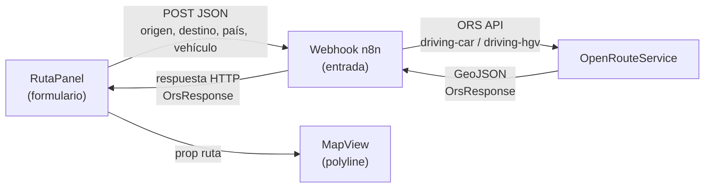

# Panel de Cálculo de Rutas — "Ruta"

Añadir un nuevo botón **"Ruta"** en el NavRail (debajo de "Mapa") que abre un panel lateral con un formulario para calcular rutas a través de OpenRouteService vía un workflow de n8n.

---

## Flujo de Datos



El frontend llama directamente al webhook de entrada de n8n con un `fetch` POST y espera la respuesta GeoJSON sincrónica (el workflow n8n retorna la ruta al mismo request de llamada al webhook).

---

## Open Questions

> [!IMPORTANT]
> **¿La URL del webhook de n8n está en una variable de entorno `.env.local`?**
> Necesito saber la URL base de n8n (ej. `http://localhost:5678`) para configurar la llamada fetch. Si ya tienes una variable como `NEXT_PUBLIC_N8N_WEBHOOK_URL` o similar, indícamela.

> [!IMPORTANT]
> **¿El workflow de n8n ya existe o debe diseñarse ahora?**
> El plan cubre el lado del frontend. El workflow n8n deberá:
> 1. Recibir el POST del frontend
> 2. Geocodificar origen y destino (ej. con ORS Geocoding o Nominatim)
> 3. Calcular la ruta con ORS `/v2/directions/{profile}/geojson`
> 4. Responder con el GeoJSON (`OrsResponse`) al mismo webhook de entrada
>
> ¿Quieres que también documente el diseño del workflow de n8n?

> [!NOTE]
> **Países disponibles**: La especificación dice Argentina, Bolivia y Perú. Sin embargo, los pasos fronterizos mostrados actualmente en el mapa son Chile-Argentina únicamente. ¿Se deben incluir Bolivia y Perú igual aunque el mapa aún no tenga esos datos?

---

## Proposed Changes

### Component: RutaPanel (nuevo)

#### [NEW] `RutaPanel/RutaPanel.tsx`
Panel lateral de mismo ancho y estilo que `FilterSidebar` (288px, glassmorphism, `var(--bg-glass)`). Contiene:

- **Header**: título "Calcular Ruta", subtítulo "Chile → Argentina / Bolivia / Perú"
- **Campo origen**: input de texto libre (dirección en Chile)
- **Campo destino**: input de texto libre (dirección en el país de destino)
- **Selector País de destino**: dropdown con opciones `Argentina | Bolivia | Perú`
- **Selector Tipo de vehículo**: radio buttons estilados como los del FilterSidebar — `Coche | Camión`
- **Selector Subtipo de camión** (condicional, aparece con animación si se elige "Camión"):
  - Opciones: `General, Autobús, Agrícola, Forestal, Reparto, Mercancía`
  - Tip informativo: *"Especificar el tipo puede mejorar el cálculo de ruta considerando restricciones de altura, peso y acceso"*
- **Botón "Calcular ruta"** (`.primaryButton`): lanza el fetch al webhook n8n. Muestra estado de carga (spinner + texto "Calculando...").
- **Estado de resultado**: tras recibir la respuesta, muestra un resumen de la ruta (distancia en km, duración formateada). Botón secundario "Limpiar ruta".
- **Estado de error**: mensaje inline si el webhook falla o el cuerpo no es válido.

#### [NEW] `RutaPanel/RutaPanel.module.css`
Extensión del sistema de estilos existente. Reutiliza variables CSS (`--bg-glass`, `--border-subtle`, `--nav-active`, etc.) y clases análogas a `FilterSidebar.module.css`. Añade:
- `.tipBox` — caja informativa con ícono 💡 para el tip del camión
- `.routeSummary` — card de resultado con distancia y duración
- `.spinner` — animación de carga inline

---

### Component: NavRail (modificado)

#### [MODIFY] [`NavRail.tsx`](file:///c:/Users/fingr/OneDrive/Documents/Codes/FrontierAdvice/frontend/src/components/NavRail/NavRail.tsx)
- Importar ícono `RouteIcon` (o `Navigation`) de `lucide-react`.
- Añadir un botón `"Ruta"` **después de `"Mapa"`** en el array `navItems` — pero como **botón de estado local** (no `<Link>`), ya que abre un panel superpuesto en la misma página `/mapa`, sin cambiar de ruta.
- El NavRail necesita aceptar `onRutaToggle` / `rutaOpen` como props, **o** usar un estado compartido (ver MapDashboard más abajo).

---

### Component: MapDashboard (modificado)

#### [MODIFY] [`MapDashboard.tsx`](file:///c:/Users/fingr/OneDrive/Documents/Codes/FrontierAdvice/frontend/src/components/MapArea/MapDashboard.tsx)
Es el orquestador. Se añade:
- Estado `rutaPanelOpen: boolean` — controla visibilidad de `RutaPanel`
- Estado `rutaOrs: OrsResponse | null` — almacena la ruta calculada por n8n y la pasa a `<MapView ruta={rutaOrs} />`
- El botón temporal "🗣 Ocultar ruta / Ver ruta CL→AR" existente se **elimina** (reemplazado por el flujo real)
- Se renderiza `<RutaPanel>` al lado de `<FilterSidebar>` (o superpuesto)

---

### Networking: hook `useCalcularRuta` (nuevo)

#### [NEW] `lib/hooks/useCalcularRuta.ts`
Custom hook que encapsula el `fetch` al webhook de n8n:

```typescript
interface RutaParams {
  origen: string;
  destino: string;
  paisDestino: 'Argentina' | 'Bolivia' | 'Peru';
  tipoVehiculo: 'coche' | 'camion';
  subtipoCamion?: string;
}

// Retorna: { calcular, loading, error, ruta }
```

- Envía `POST` a `process.env.NEXT_PUBLIC_N8N_WEBHOOK_URL`
- Espera la respuesta como `OrsResponse` (igual al tipo ya definido en `types.ts`)
- Maneja errores de red y de parseo

---

### Env Config

#### [MODIFY] `.env.local` (frontend)
Añadir variable:
```
NEXT_PUBLIC_N8N_WEBHOOK_URL=http://localhost:5678/webhook/calcular-ruta
```

---

## Verification Plan

### Manual Verification
1. Botón "Ruta" aparece en NavRail entre "Mapa" e "Historial", se activa visualmente al hacer click.
2. Panel se abre con animación slide-in al lado de FilterSidebar.
3. Al elegir "Camión", el subtipo aparece con transición suave.
4. El tip informativo se muestra correctamente.
5. El botón "Calcular ruta" muestra spinner durante la llamada.
6. Al recibir respuesta válida de n8n, la polilínea aparece en el mapa y el panel muestra el resumen.
7. El botón "Limpiar ruta" remueve la polilínea del mapa.
8. Si el webhook falla, se muestra el error inline en el panel.
