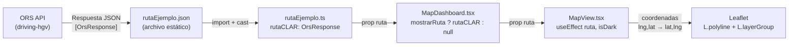

# Integración de Rutas GeoJSON con OpenRouteService (ORS)

## Resumen

Esta documentación describe los cambios realizados en el frontend de **FrontierAdvice** para integrar y visualizar los resultados de cálculo de rutas en formato GeoJSON proporcionados por la API de **OpenRouteService (ORS)**.

La integración permite superponer una polilínea de ruta interactiva directamente sobre el mapa Leaflet, mostrando datos de distancia y duración mediante un tooltip. El diseño es reactivo al tema (claro/oscuro) y la capa es completamente removible.

---

## Archivos Modificados / Creados

### 1. [`types.ts`](file:///c:/Users/fingr/OneDrive/Documents/Codes/FrontierAdvice/frontend/src/lib/types.ts) — Definición de tipos TypeScript

**Cambio**: Se añadió un bloque completo de interfaces que modelan la respuesta estándar de la API de ORS (`/v2/directions/{profile}/geojson`).

#### Interfaces añadidas

```typescript
// Paso individual de la ruta (una maniobra, ej. "Girar a la derecha")
interface OrsSegmentStep {
  distance: number;      // metros
  duration: number;      // segundos
  type: number;          // código de tipo de maniobra
  instruction: string;   // instrucción legible ("Turn right onto...")
  name: string;          // nombre de la vía
  way_points: [number, number]; // índices en el array de coordenadas
  exit_number?: number;  // número de salida (para rotondas)
}

// Segmento de la ruta (conjunto de pasos)
interface OrsSegment {
  distance: number;
  duration: number;
  steps: OrsSegmentStep[];
}

// Resumen de distancia y tiempo total
interface OrsRouteSummary {
  distance: number; // metros
  duration: number; // segundos
}

// Propiedades del Feature GeoJSON
interface OrsFeatureProperties {
  segments: OrsSegment[];
  way_points: [number, number];
  summary: OrsRouteSummary;
}

// Feature GeoJSON individual (la ruta como LineString)
interface OrsFeature {
  type: 'Feature';
  bbox: [number, number, number, number];
  properties: OrsFeatureProperties;
  geometry: {
    type: 'LineString';
    coordinates: [number, number][]; // [lng, lat] — orden GeoJSON estándar
  };
}

// Respuesta completa de ORS (FeatureCollection)
interface OrsResponse {
  type: 'FeatureCollection';
  bbox: [number, number, number, number];
  features: OrsFeature[];
  metadata: { ... }; // atribución, perfil de vehículo, versión del motor, etc.
}
```

> [!IMPORTANT]
> ORS devuelve coordenadas en el orden `[lng, lat]` (estándar GeoJSON), que es el **inverso** al que espera Leaflet (`[lat, lng]`). Este swap se realiza explícitamente al dibujar la ruta en el mapa.

---

### 2. [`rutaEjemplo.json`](file:///c:/Users/fingr/OneDrive/Documents/Codes/FrontierAdvice/frontend/src/lib/rutaEjemplo.json) — Datos de ruta de prueba

**Cambio**: Se añadió un archivo JSON con una respuesta real de la API ORS (perfil `driving-hgv` / camión/bus) para uso como dato estático de prueba durante el desarrollo.

| Dato            | Valor                          |
|-----------------|--------------------------------|
| Origen          | Curicó, Chile (Región del Maule) |
| Destino         | Buenos Aires, Argentina         |
| Perfil de vehículo | `driving-hgv` (camión pesado / bus) |
| Distancia total | ~1.466 km                       |
| Duración estimada | ~21 h 31 min                  |
| Coordenadas     | ~7.290 puntos en el `LineString` |

La respuesta está envuelta en un array `[OrsResponse]`, que es el comportamiento real de la API ORS al consultar el endpoint batch/array.

---

### 3. [`rutaEjemplo.ts`](file:///c:/Users/fingr/OneDrive/Documents/Codes/FrontierAdvice/frontend/src/lib/rutaEjemplo.ts) — Módulo adaptador

**Cambio**: Se creó un módulo TypeScript que importa el JSON y lo deserializa al tipo correcto.

```typescript
import type { OrsResponse } from '@/lib/types';
import rawData from './rutaEjemplo.json';

// ORS devuelve un array; se extrae el primer elemento
export const rutaCLAR: OrsResponse = (rawData as OrsResponse[])[0];
```

**Por qué existe este módulo**: El JSON contiene el array raíz `[{...}]`. Sin este adaptador, cada componente consumidor necesitaría desestructurar el índice `[0]` manualmente, lo que es propenso a errores. El módulo expone directamente la ruta lista para consumir.

---

### 4. [`MapView.tsx`](file:///c:/Users/fingr/OneDrive/Documents/Codes/FrontierAdvice/frontend/src/components/MapArea/MapView.tsx) — Renderizado de la ruta en el mapa

**Cambios**:

#### a) Nueva prop `ruta` en la interfaz del componente

```typescript
interface MapViewProps {
  pasos: PasoFronterizo[];
  onSelectPaso: (paso: PasoFronterizo) => void;
  selectedPasoId?: string;
  ruta?: OrsResponse | null;  // ← NUEVO: GeoJSON de ORS (opcional)
}
```

La prop es opcional y puede ser `null` para ocultar la ruta.

#### b) Nueva ref `routeLayerRef`

```typescript
const routeLayerRef = useRef<L.LayerGroup | null>(null);
```

Almacena la capa de la ruta activa para poder destruirla limpiamente cuando cambia la prop `ruta` (o el tema).

#### c) Nuevo `useEffect` para renderizar la ruta ORS

Este es el cambio principal. Se añadió un efecto que:

1. **Limpia** la capa anterior si existe.
2. **Convierte** las coordenadas de `[lng, lat]` (GeoJSON) a `[lat, lng]` (Leaflet):
   ```typescript
   const latlngs = feature.geometry.coordinates.map(([lng, lat]) => [lat, lng]);
   ```
3. **Dibuja dos polilíneas** superpuestas para el efecto de "casing" (borde exterior):
   - **Casing**: línea más gruesa (`weight: 10`) de color blanco/oscuro semitransparente
   - **Línea principal**: línea azul (`weight: 5`), adaptada al tema (azul claro en dark, azul estándar en light)
4. **Calcula y formatea** la distancia y duración desde `feature.properties.summary`:
   ```typescript
   const km = (summary.distance / 1000).toFixed(1);
   const hrs = Math.floor(min / 60);
   const rem = min % 60;
   const durStr = hrs > 0 ? `${hrs}h ${rem}min` : `${min} min`;
   ```
5. **Añade un tooltip sticky** a la línea principal con el resumen `🛣 X km · ⏱ Xh Xmin`.
6. **Ajusta el viewport** del mapa con `fitBounds` al bounding box de todos los puntos de la ruta.

```typescript
// Dependencias del efecto: se re-ejecuta si cambia la ruta O el tema
}, [ruta, isDark]);
```

#### d) Estilo adaptativo al tema

| Elemento       | Modo claro       | Modo oscuro      |
|----------------|------------------|------------------|
| Línea principal | `#2563eb` (azul) | `#60a5fa` (azul claro) |
| Casing (borde) | `rgba(255,255,255,0.6)` | `rgba(15,23,42,0.6)` |
| Fondo tooltip  | `rgba(255,255,255,0.95)` | `rgba(15,23,42,0.95)` |
| Texto tooltip  | `#0f172a` (oscuro)  | `#f8fafc` (claro)  |

---

### 5. [`MapDashboard.tsx`](file:///c:/Users/fingr/OneDrive/Documents\Codes\FrontierAdvice\frontend\src\components\MapArea\MapDashboard.tsx) — Orquestación y toggle

**Cambios**:

#### a) Importación del módulo de ruta

```typescript
import { rutaCLAR } from '@/lib/rutaEjemplo';
```

#### b) Estado de visibilidad de la ruta

```typescript
const [mostrarRuta, setMostrarRuta] = useState(true);
```

La ruta se muestra por defecto al cargar la aplicación.

#### c) Botón de toggle temporal (para testing)

Se añadió un botón flotante sobre el mapa que permite mostrar u ocultar la ruta de ejemplo:

```tsx
<button onClick={() => setMostrarRuta((v) => !v)}>
  {mostrarRuta ? '🗣 Ocultar ruta' : '🗣 Ver ruta CL→AR'}
</button>
```

- **Activo**: fondo azul `#2563eb`
- **Inactivo**: fondo oscuro semitransparente con `backdropFilter: blur(8px)`

#### d) Prop `ruta` en `<MapView>`

```tsx
<MapView
  pasos={pasosFiltrados}
  onSelectPaso={handleSelectPaso}
  selectedPasoId={selectedPaso?.id}
  ruta={mostrarRuta ? rutaCLAR : null}  // ← NUEVO
/>
```

Se pasa `null` en lugar de `undefined` cuando está oculta para disparar el efecto de limpieza correctamente.

---

## Flujo de Datos



---

## Consideraciones Futuras

> [!TIP]
> El toggle de ruta es actualmente un componente de **testing temporal**. En producción debería integrarse como un control dentro del panel de filtros (`FilterSidebar`) o el panel de información del paso (`PasoInfoPanel`).

> [!NOTE]
> El archivo `rutaEjemplo.json` es un dato estático para desarrollo. La integración real con la API de ORS debería hacerse desde el backend (Strapi o n8n), realizando la petición con una API Key y cacheando los resultados para evitar rate limiting.

> [!WARNING]
> La ruta de ejemplo usa el perfil `driving-hgv` (vehículo pesado/bus). Para vehículos ligeros, el trazado y las restricciones de acceso a vías (`roadaccessrestrictions`) serán diferentes.
