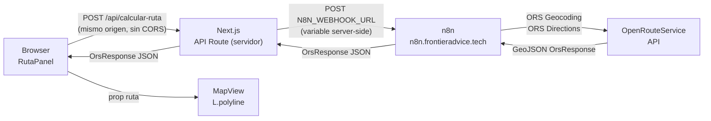

# Walkthrough — Panel de Cálculo de Rutas (Feature: "Ruta")

## Resumen

Se implementó un panel lateral de cálculo de rutas integrado con **OpenRouteService (ORS)** a través de un workflow de **n8n**. El usuario ingresa origen, destino, país y tipo de vehículo; el resultado (GeoJSON) se dibuja directamente en el mapa Leaflet como una polilínea interactiva.

---

## Arquitectura de red final



> [!IMPORTANT]
> El proxy Next.js es indispensable. Los navegadores bloquean solicitudes `fetch()` de `localhost:3000 → dominio-externo` por política CORS. El servidor Next.js no tiene esa restricción.

---

## Archivos creados

### 1. [`useCalcularRuta.ts`](file:///c:/Users/fingr/OneDrive/Documents/Codes/FrontierAdvice/frontend/src/lib/hooks/useCalcularRuta.ts)

Custom hook que encapsula toda la lógica de llamada al proxy.

**Tipos exportados:**
| Tipo | Valores |
|------|---------|
| `PaisDestino` | `'Argentina' \| 'Bolivia' \| 'Peru'` |
| `TipoVehiculo` | `'coche' \| 'camion'` |
| `SubtipoCamion` | `'general' \| 'autobus' \| 'agricola' \| 'forestal' \| 'reparto' \| 'mercancia'` |

**Interfaz `RutaParams`:**
```typescript
{ origen, destino, paisDestino, tipoVehiculo, subtipoCamion? }
```

**Lo que hace internamente:**
1. Siempre llama a `/api/calcular-ruta` (relativo, mismo origen → sin CORS)
2. Construye el payload en el formato que n8n espera:
   ```json
   {
     "pickup_address": "<origen>",
     "pickup_acountryCode": "CL",
     "destination_address": "<destino>",
     "destination_countryCode": "AR|BO|PE",
     "tipoVehiculo": "camion",
     "subtipoCamion": "autobus"
   }
   ```
3. Acepta la respuesta como `OrsResponse` o `OrsResponse[]` (toma `[0]` si es array)
4. Valida que `type === 'FeatureCollection'` y `features.length > 0`
5. Expone: `{ calcular, limpiar, loading, error, ruta }`

---

### 2. [`/api/calcular-ruta/route.ts`](file:///c:/Users/fingr/OneDrive/Documents/Codes/FrontierAdvice/frontend/src/app/api/calcular-ruta/route.ts)

**Next.js App Router API Route** — actúa como proxy server-side hacia n8n.

```
POST /api/calcular-ruta
```

**Comportamiento:**
- Lee `N8N_WEBHOOK_URL` del entorno del servidor (`.env.local`)
- Reenvía el body JSON al webhook de n8n tal cual
- Timeout de 60 segundos (rutas largas tardan más)
- Si n8n responde con error HTTP → devuelve `{ error, detail }` con el mismo status
- Si hay error de red → devuelve `502 Bad Gateway`
- Reenvía la respuesta exitosa de n8n sin modificaciones

**Variable de entorno utilizada (server-side únicamente):**
```
N8N_WEBHOOK_URL=https://n8n.frontieradvice.tech/webhook-test/calcular-ruta
```

---

### 3. [`RutaPanel.module.css`](file:///c:/Users/fingr/OneDrive/Documents/Codes/FrontierAdvice/frontend/src/components/RutaPanel/RutaPanel.module.css)

Hoja de estilos del panel. Reutiliza el 100% de las variables CSS del design system existente (`--bg-glass`, `--border-subtle`, `--nav-active`, etc.). Clases destacadas:

| Clase | Propósito |
|-------|-----------|
| `.panel` | Contenedor principal — 288px, glassmorphism, igual que FilterSidebar |
| `.radioCard` / `.radioActive` | Tarjetas de selección de vehículo |
| `.subtypeSection` | Reveal animado del subtipo de camión (`slideDown` keyframe) |
| `.tipBox` | Caja informativa azul para el tip del camión |
| `.summaryCard` | Card verde de resultado con distancia y duración |
| `.errorBox` | Caja roja de error inline |
| `.spinner` | Spinner CSS de carga animado |

---

### 4. [`RutaPanel.tsx`](file:///c:/Users/fingr/OneDrive/Documents/Codes/FrontierAdvice/frontend/src/components/RutaPanel/RutaPanel.tsx)

Panel lateral de formulario con los siguientes campos:

| Campo | Tipo | Notas |
|-------|------|-------|
| Origen (Chile) | Text input | Placeholder contextual |
| País de destino | Select | Argentina 🇦🇷 / Bolivia 🇧🇴 / Perú 🇵🇪 |
| Destino | Text input | Placeholder actualiza con el país seleccionado |
| Tipo de vehículo | Radio cards | 🚗 Coche / 🚛 Camión |
| Tipo de camión | Select condicional | Solo visible si se elige "Camión". Opciones: General, Autobús, Agrícola, Forestal, Reparto, Mercancía. Marcado como **(opcional)** |

**Estados de UI:**
- **Carga**: botón muestra spinner + "Calculando...", todos los inputs deshabilitados
- **Error**: caja roja inline con el mensaje del servidor
- **Éxito**: card verde con distancia (km) y duración (h min) + botón "Limpiar ruta"

**Comunicación con el padre:**
El componente recibe `onRutaCalculada: (ruta: OrsResponse | null) => void`. Usa un `useEffect` que dispara este callback cada vez que `ruta` cambia (incluyendo cuando se limpia → `null`).

---

### 5. [`.env.local`](file:///c:/Users/fingr/OneDrive/Documents/Codes/FrontierAdvice/frontend/.env.local)

Configuración de la URL de n8n para el servidor Next.js:

```bash
# Testing (workflow en modo "Listen for test event"):
N8N_WEBHOOK_URL=https://n8n.frontieradvice.tech/webhook-test/calcular-ruta

# Producción (workflow activado):
# N8N_WEBHOOK_URL=https://n8n.frontieradvice.tech/webhook/calcular-ruta
```

> [!NOTE]
> Esta variable **NO** tiene prefijo `NEXT_PUBLIC_`. Solo existe en el servidor y nunca se expone al browser.

---

## Archivos modificados

### [`NavRail.tsx`](file:///c:/Users/fingr/OneDrive/Documents/Codes/FrontierAdvice/frontend/src/components/NavRail/NavRail.tsx)

**Cambios:**
1. Se añadió la interfaz `NavRailProps` con `rutaOpen?: boolean` y `onRutaToggle?: () => void`
2. Se importó el ícono `Route` de `lucide-react`
3. Se añadió el botón "Ruta" **solo visible en `/mapa`** (condición `pathname.startsWith('/mapa')`)
4. El botón se activa visualmente (clase `.active`) cuando `rutaOpen === true`
5. No es un `<Link>` sino un `<button>` porque no navega a otra página

```tsx
{pathname.startsWith('/mapa') && (
  <button id="nav-ruta" onClick={onRutaToggle}
    className={`${styles.navButton} ${rutaOpen ? styles.active : ''}`}>
    <Route className="w-5 h-5" />
    <span className={styles.tooltip}>Ruta</span>
  </button>
)}
```

---

### [`MapDashboard.tsx`](file:///c:/Users/fingr/OneDrive/Documents/Codes/FrontierAdvice/frontend/src/components/MapArea/MapDashboard.tsx)

Es el orquestador central. Cambios:

| Antes | Después |
|-------|---------|
| Importaba `rutaCLAR` (ruta hardcodeada) | Eliminado |
| Tenía botón temporal "🗣 Ocultar ruta" | Eliminado |
| NavRail importado en `mapa/page.tsx` | Ahora importado aquí para recibir props |
| `mostrarRuta: boolean` (demo) | `rutaPanelOpen: boolean` + `rutaOrs: OrsResponse \| null` |

**Estado añadido:**
```typescript
const [rutaPanelOpen, setRutaPanelOpen] = useState(false);
const [rutaOrs, setRutaOrs] = useState<OrsResponse | null>(null);
```

**Callbacks:**
```typescript
const handleRutaToggle    = useCallback(() => setRutaPanelOpen(v => !v), []);
const handleRutaCalculada = useCallback((ruta) => setRutaOrs(ruta), []);
```

---

### [`mapa/page.tsx`](file:///c:/Users/fingr/OneDrive/Documents/Codes/FrontierAdvice/frontend/src/app/mapa/page.tsx)

`<NavRail />` se eliminó de aquí. Ahora `MapDashboard` lo renderiza internamente para poder pasarle las props `rutaOpen` y `onRutaToggle`.

---

### [`rutaEjemplo.ts`](file:///c:/Users/fingr/OneDrive/Documents/Codes/FrontierAdvice/frontend/src/lib/rutaEjemplo.ts)

Error TypeScript preexistente corregido: el cast de JSON a `OrsResponse[]` requería un `as unknown` intermedio por incompatibilidad del tipo tuple `bbox`:

```typescript
// Antes (error TS2352):
export const rutaCLAR = (rawData as OrsResponse[])[0];

// Después (correcto):
export const rutaCLAR = (rawData as unknown as OrsResponse[])[0];
```

---

## Problemas encontrados y soluciones

### Problema 1 — CORS (Failed to fetch)
**Síntoma:** El browser lanzaba `TypeError: Failed to fetch` al intentar llamar a `https://n8n.frontieradvice.tech` directamente.

**Causa:** El navegador bloquea peticiones cross-origin desde el dev server de Next.js hacia dominios externos sin cabeceras CORS apropiadas.

**Solución:** Se creó la API Route `/api/calcular-ruta` como proxy server-side. El browser solo llama a rutas del mismo origen; el servidor Next.js (sin restricciones CORS) llama a n8n.

---

### Problema 2 — Variables de entorno no cargadas
**Síntoma:** El error persistía después de añadir `NEXT_PUBLIC_N8N_WEBHOOK_URL` al `.env.local`.

**Causa:** Las variables de entorno en Next.js se leen al arrancar el proceso. Sin reiniciar `npm run dev`, el servidor seguía sin tenerlas.

**Solución:** Se simplificó la arquitectura eliminando la dependencia de variables de entorno en el cliente. La URL `/api/calcular-ruta` está hardcodeada en el hook (siempre es el mismo servidor), y solo el servidor usa `N8N_WEBHOOK_URL`.

---

## Instrucciones de uso (testing vs producción)

### Testing (workflow en modo test en n8n)
1. En n8n, abrir el workflow "ORS route"
2. Hacer click en el nodo **Webhook** → "Listen for test event" (ícono naranja)
3. En `.env.local` asegurarse que está activa la línea:
   ```
   N8N_WEBHOOK_URL=https://n8n.frontieradvice.tech/webhook-test/calcular-ruta
   ```
4. Reiniciar Next.js si se modificó `.env.local`

### Producción (workflow activado)
1. En n8n, activar el workflow con el toggle
2. En `.env.local` cambiar a:
   ```
   N8N_WEBHOOK_URL=https://n8n.frontieradvice.tech/webhook/calcular-ruta
   ```
3. Reiniciar Next.js
